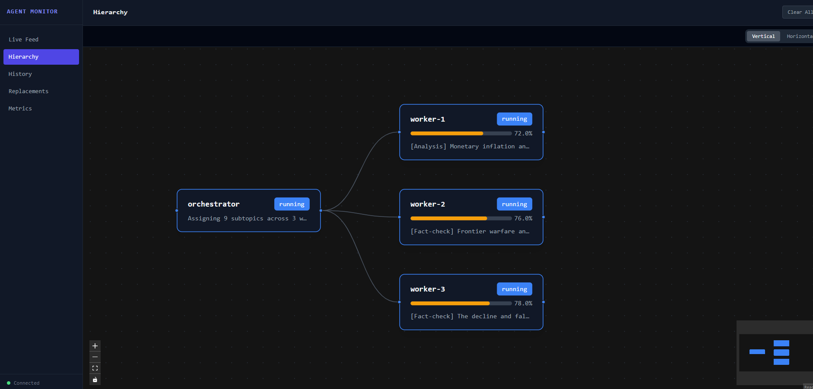
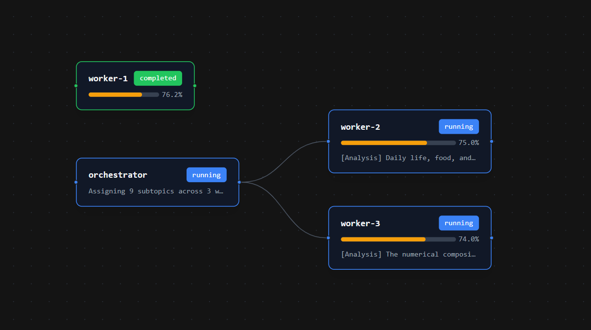
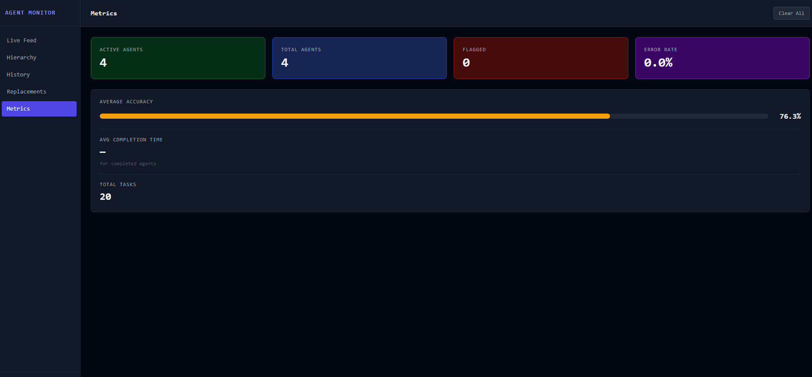
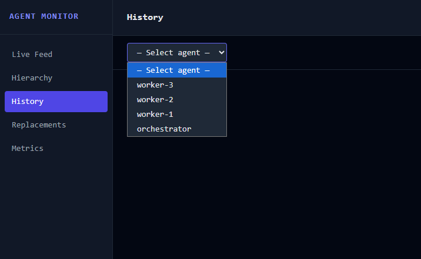

# Agent Monitor

A real-time dashboard for monitoring AI agent pipelines. Agents report their status, accuracy, and task progress via a simple REST API. The dashboard displays a live feed, hierarchy tree, task history, metrics, and a full replacement chain history.

---

## Quick start

```bash
curl -O https://raw.githubusercontent.com/rcarlisle76/agent-monitor/main/docker-compose.deploy.yml
docker compose -f docker-compose.deploy.yml up
```

Open **http://localhost:3000**

> No GitHub account? Download [`docker-compose.deploy.yml`](docker-compose.deploy.yml) manually and run the same command.

Or run with a single `docker run` command (no compose file needed):

```bash
docker run -d -p 3000:3000 -v agent-monitor-data:/app/data rcarlisle1976/agent-monitor
```

---

## Screenshots









---

## What you get

| Panel | Description |
|---|---|
| **Live Feed** | Real-time stream of every agent event, colour-coded by status |
| **Hierarchy** | Visual tree of parent → child agent relationships, updates live |
| **History** | Filterable, paginated log of every task record per agent |
| **Replacements** | Full chain history of terminated → replacement agents |
| **Metrics** | Active agents, error rate, average accuracy, average completion time |

Agents whose accuracy drops below the configured threshold are automatically **flagged**. The dashboard signals this back to your orchestrator via the API response so it can terminate and replace low-performing agents.

---

## Configuration

Edit `docker-compose.deploy.yml` before starting:

```yaml
environment:
  - ACCURACY_FLAG_THRESHOLD=70.0  # flag agents below this accuracy %
```

| Variable | Default | Description |
|---|---|---|
| `ACCURACY_FLAG_THRESHOLD` | `70.0` | Accuracy % below which an agent is flagged |
| `DB_PATH` | `/app/data/agent_monitor.db` | SQLite database location inside the container |

**Change the port** — edit `"3000:3000"` to e.g. `"8080:3000"` in the compose file.

Data persists across restarts via a named Docker volume (`db_data`).

---

## Connecting your agents

Agents report to the dashboard with a single HTTP POST. No SDK required.

### The API

**POST** `http://localhost:3000/api/report`

```json
{
  "agent_id":  "worker-1",
  "status":    "running",
  "task":      "Summarising document A",
  "parent_id": "orchestrator",
  "replaces":  null,
  "accuracy":  87.4,
  "metadata":  {}
}
```

| Field | Type | Required | Notes |
|---|---|---|---|
| `agent_id` | string | **yes** | Unique identifier for this agent |
| `status` | string | **yes** | `running` `idle` `completed` `error` `terminated` |
| `task` | string | no | Current task description |
| `parent_id` | string | no | Parent/orchestrator agent ID |
| `replaces` | string | no | ID of the agent this one was spawned to replace |
| `accuracy` | float 0–100 | no | Triggers flag when below threshold |
| `metadata` | object | no | Any extra key/value pairs |

**Response**

```json
{ "ok": true, "flagged": false }
```

When `flagged` is `true`, the agent's accuracy has dropped below the threshold — your orchestrator should terminate it and spawn a replacement.

---

### Python (drop-in client)

Download [`agent_monitor_client.py`](agent_monitor_client.py) into your project. No pip install needed — uses only the standard library.

```python
from agent_monitor_client import AgentMonitor

monitor = AgentMonitor("http://localhost:3000")

# Basic usage
monitor.running("my-agent", "Loading data")
monitor.running("my-agent", "Processing", accuracy=91.2)
monitor.completed("my-agent", accuracy=88.5)

# Hierarchical agents
monitor.running("orchestrator", "Starting pipeline")
monitor.running("worker-1", "Chunk 1", parent_id="orchestrator", accuracy=85.0)

# Context manager — reports idle on exit, error on exception
with monitor.agent("worker-2", parent_id="orchestrator") as agent:
    agent.running("Step 1", accuracy=90.0)
    agent.running("Step 2", accuracy=78.3)
    agent.completed(accuracy=82.1)

# React to flagging
result = monitor.running("worker-3", "Step 1", accuracy=61.0)
if result.get("flagged"):
    monitor.terminated("worker-3", reason="low_accuracy")
    monitor.running("worker-3-v2", "Taking over",
                    parent_id="orchestrator", replaces="worker-3")
```

### Python (raw requests)

```python
import requests

def report(agent_id, status, task=None, **kwargs):
    return requests.post("http://localhost:3000/api/report", json={
        "agent_id": agent_id, "status": status, "task": task, **kwargs
    }, timeout=5).json()

report("my-agent", "running", "Step 1", accuracy=88.0, parent_id="orchestrator")
report("my-agent", "completed", accuracy=91.5)
```

### JavaScript / Node.js

```js
const MONITOR = "http://localhost:3000";

async function report(agentId, status, task, opts = {}) {
  return fetch(`${MONITOR}/api/report`, {
    method: "POST",
    headers: { "Content-Type": "application/json" },
    body: JSON.stringify({ agent_id: agentId, status, task, ...opts }),
  }).then(r => r.json());
}

await report("my-agent", "running", "Step 1", { parent_id: "orchestrator", accuracy: 88.0 });
await report("my-agent", "completed", null, { accuracy: 91.5 });
```

### curl / shell

```bash
curl -s -X POST http://localhost:3000/api/report \
  -H "Content-Type: application/json" \
  -d '{"agent_id":"my-agent","status":"running","task":"Step 1","accuracy":88.0}'
```

**Windows cmd:**
```cmd
curl -s -X POST http://localhost:3000/api/report -H "Content-Type: application/json" -d "{\"agent_id\":\"my-agent\",\"status\":\"running\",\"task\":\"Step 1\",\"accuracy\":88.0}"
```

---

## Full REST API reference

| Method | Path | Description |
|---|---|---|
| `POST` | `/api/report` | Ingest an agent status update |
| `GET` | `/api/agents` | List all agents with current status |
| `GET` | `/api/agents/{id}/history` | Last 200 task records for one agent |
| `GET` | `/api/metrics` | Aggregated stats |
| `GET` | `/api/replacement-chains` | Full termination/replacement chain history |
| `WS` | `/ws` | WebSocket — streams live agent_update events |

### WebSocket event format

```json
{
  "event":     "agent_update",
  "agent_id":  "worker-1",
  "parent_id": "orchestrator",
  "status":    "running",
  "task":      "Summarising document A",
  "accuracy":  87.4,
  "flagged":   false,
  "metadata":  {},
  "timestamp": "2026-05-17T02:44:25.123456+00:00"
}
```

---

## Orchestrator pattern

The dashboard flags agents but the termination decision belongs to your code:

```python
from agent_monitor_client import AgentMonitor

monitor = AgentMonitor("http://localhost:3000")

class Orchestrator:
    def run_worker(self, worker_id, docs):
        monitor.running("orchestrator", f"Assigned {len(docs)} docs to {worker_id}")
        for doc in docs:
            result = monitor.running(worker_id, f"Processing {doc}",
                                     parent_id="orchestrator",
                                     accuracy=self.score(doc))
            if result.get("flagged"):
                self.terminate_and_replace(worker_id)
                return

    def terminate_and_replace(self, worker_id):
        monitor.terminated(worker_id, reason="low_accuracy")
        replacement = f"{worker_id}-v2"
        monitor.running(replacement, "Starting",
                        parent_id="orchestrator", replaces=worker_id)
        # ... hand off remaining work to replacement ...
```

---

## Agents on remote machines

If the dashboard is running on a server, replace `localhost` with its IP or hostname:

```python
monitor = AgentMonitor("http://192.168.1.50:3000")
```

Ensure port `3000` (or your custom port) is reachable from the agent machines.

---

## Architecture

```
Any Agent  ──POST /api/report──▶  FastAPI + SQLite  ──WebSocket──▶  React Dashboard
                                   (uvicorn :8000)                   (Nginx :3000)
                                   └── both run inside one container via supervisord
```

- **Backend**: Python 3.12, FastAPI, aiosqlite, SQLite
- **Frontend**: React 18, Vite, Tailwind CSS, React Flow, TanStack Query
- **Transport**: REST for ingestion, WebSocket for real-time push
- **Persistence**: SQLite in a named Docker volume (survives restarts)

---

## Demo

A simulation script is included in the source repository to exercise all features:

```bash
python demo_agents.py --workers 4 --docs 12
```

This spins up an orchestrator and workers that process documents, report accuracy per step, and automatically replace agents that fall below the threshold.

---

## Image

| Image | Description |
|---|---|
| `rcarlisle1976/agent-monitor` | All-in-one: FastAPI backend + React dashboard (Nginx + supervisord) |

Built for `linux/amd64`.
